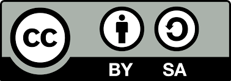

[Bootcamp en Código Facilito.]()
[Recursos en Google Drive.](https://drive.google.com/drive/folders/10VMty4V39MptdAZHcxZYnWOh5fgSEEv3?usp=sharing)
[Soporte.](https://codigofacilito.com/soporte)

Notas de estudio del Bootcamp Premium de SQL de Código Facilito.
-------------

Primero que nada, gracias por visitar este repositorio.

Yo [KrisbelGV](https://github.com/KrisbelGV), su autora, soy nueva usando GitHub y actualmente curso el Bootcamp Premium de SQL en Código Facilito, estas son mis notas de estudio.

¡Sugerencias son más que bienvenidas!

Descargo de responsabilidad y condiciones de uso.
-------------

- Este repositorio no es ni pretende ser una guía de estudio, fuente certificada ni mucho menos remplazo a las clases y recursos impartidos por los docentes.

- La información aquí suministrada consiste en un vistazo general (no detallado) a los temas propuestos y desarrollados por el programa.

- Puede contener errores ortográficos, sintácticos, definiciones ambiguas u uso de terminología incorrecta.

- En medida de lo posible busco mantenerlo certero y actualizado, agradeciendo recibir feedback.

- Permanecerá público hasta la finalización del bootcamp y puede aún después.

- Basados en estas líneas, los colaboradores pueden:

    1. Sugerir cambios.

    2. Realizar preguntas.

    3. Clonar el repositorio.

- En sola consideración de las siguientes clausulas restrictivas:

    1. No doy mi consentimiento para hacer empleo de mis notas y respuestas a ejercicios propuestos en presentarlas como si fueran propias.

    2. No me hago responsable del uso indebido de las mismas u que derive en algún incumplimiento a las normas impuestas.

Gracias nuevamente por su atención. ¡Sigamos aprendiendo!

Licencia.
-------------

Decidí optar por Creative Commons y no por GPL, pese contener código, dado consiste en material educativo y no software funcional o con un propósito en sí más que aprendizaje, a saber, específicamente la licencia: Atribución/Reconocimiento-CompartirIgual 4.0 Internacional, [disponible en su página web](https://creativecommons.org/licenses/by-sa/4.0/) y [una copia en este repositorio](LICENSE.txt).

